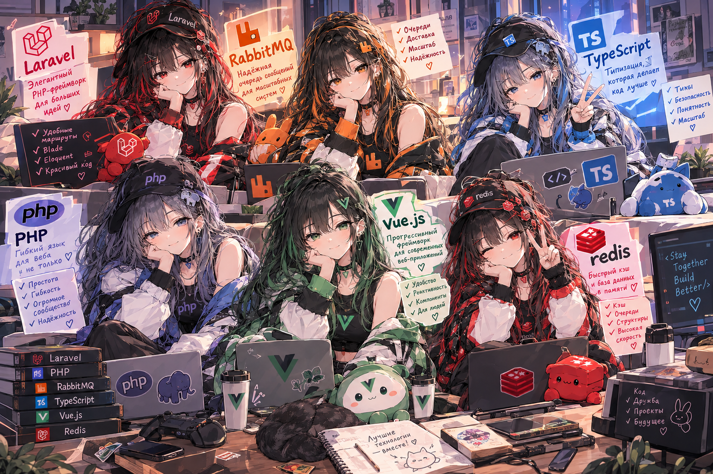
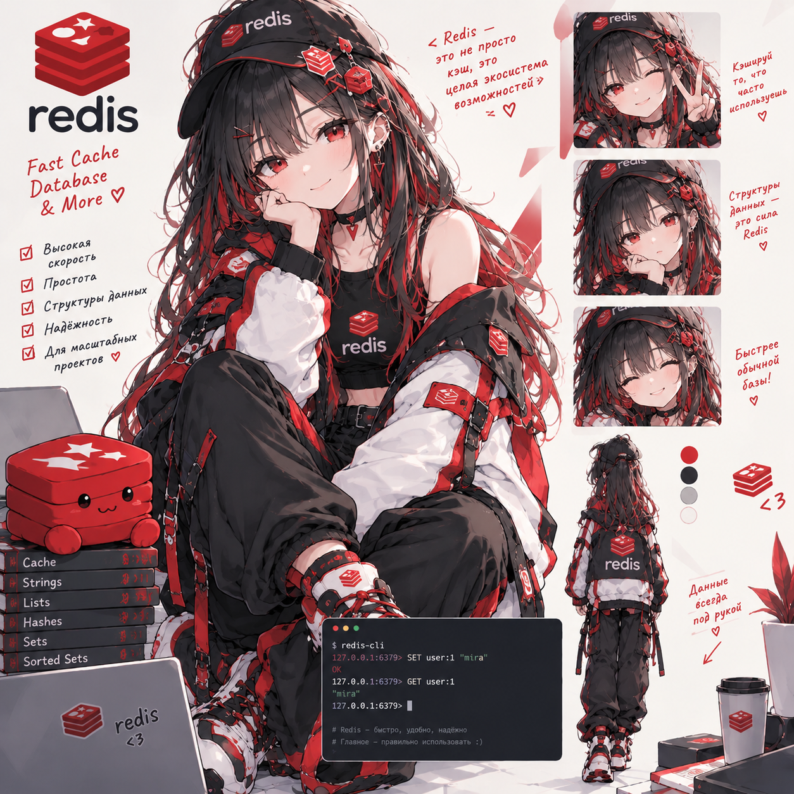
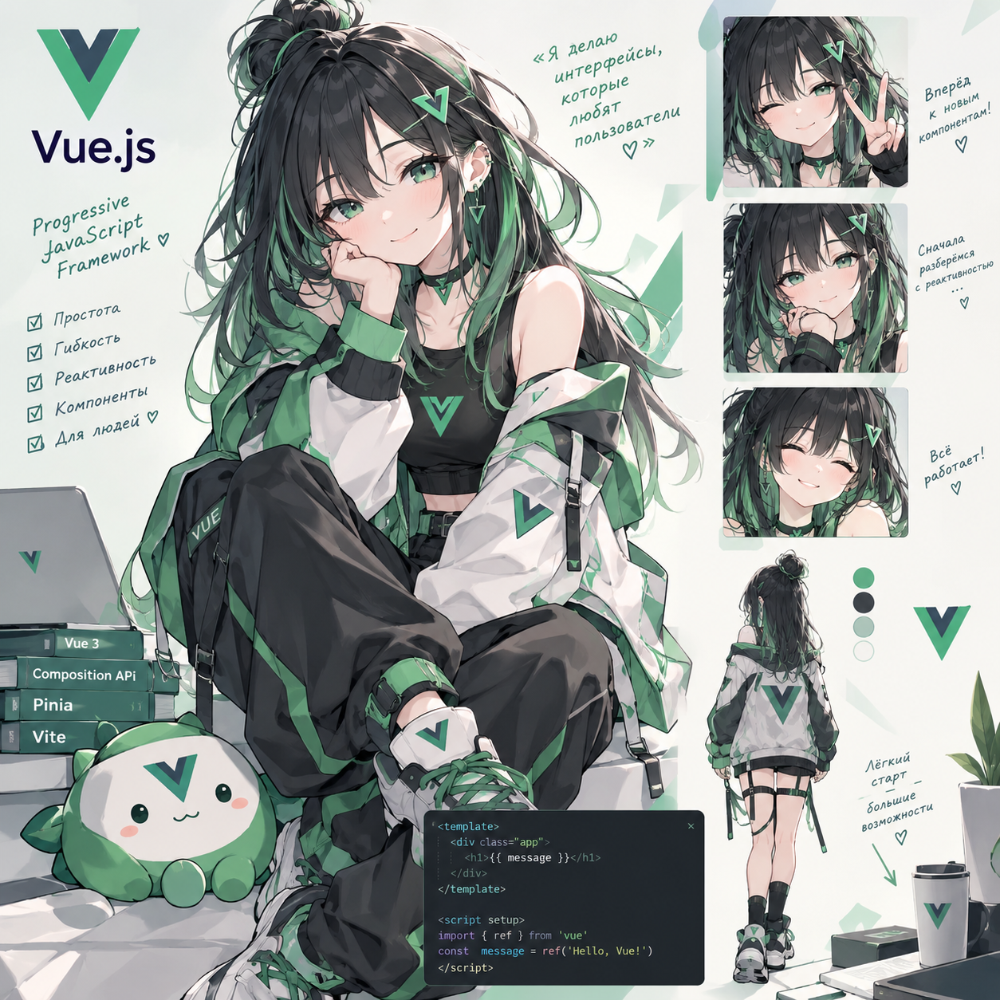
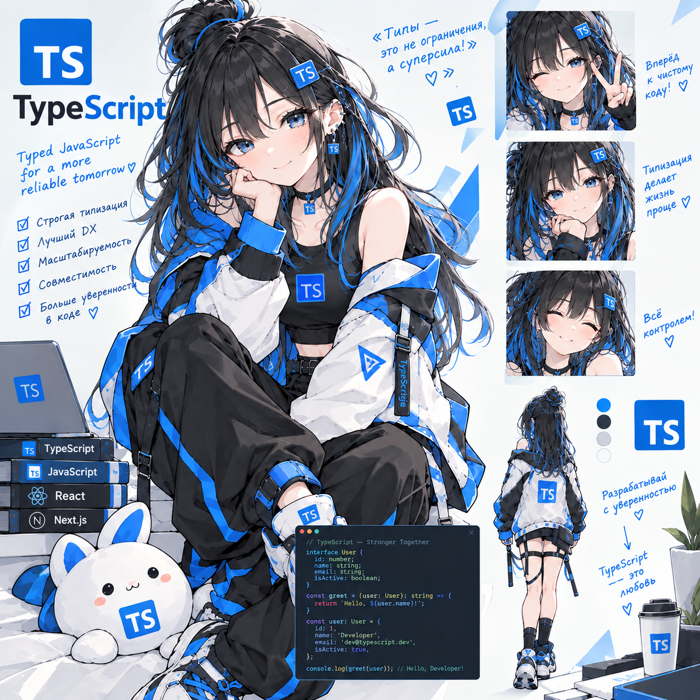

### 🌸 Обо мне

Мне 22 года, я **Backend-разработчик** с **2 годами опыта**, основной фокус — **PHP / Laravel**: проектирую API, строю бизнес-логику, работаю с очередями и кэшем через **RabbitMQ** и **Redis** для быстрых и надёжных систем. При необходимости подключаюсь и к фронту — **Vue.js** и **TypeScript** — чтобы доводить фичу от бэка до интерфейса самостоятельно.

- 🔧 Сейчас в фокусе: чистая архитектура API на Laravel и работа с очередями сообщений
- 🧩 Люблю разбираться, как устроены вещи под капотом, и наводить порядок в коде
- 🌱 Постоянно пробую новое в пет-проектах, прежде чем тащить в боевой код
- ☕ Верю, что хороший код — это код, который приятно читать

📫 **Связаться со мной:**

---

---

## 🛠️ Мой стек

| | | |
|:---:|:---:|:---:|
|   |   |   |
|   |   |   |

**Остальные инструменты:**

---

*✨ Спасибо, что заглянули! ✨*

